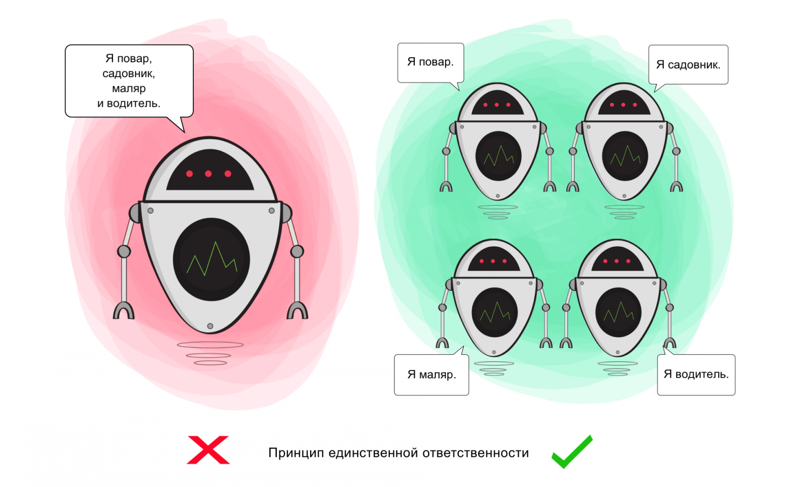

# SOLID Principles

SOLID is an acronym that refers to OOP. It is a set of rules that should be followed to write extensible, easily maintained and understandable code.

- **S: Single Responsibility Principle**.
- **O: Open-Closed Principle**.
- **L: Liskov Substitution Principle**.
- **I: Interface Segregation Principle**.
- **D: Dependency Inversion Principle**.

## Single Responsibility

Each class (or entity) should solve only one task.

If a class is responsible for several operations at once, the likelihood of bugs increases - by making changes to one of the operations, you may unknowingly affect the others.

**Purpose**.

The principle is used to separate behaviours so that bugs caused by modifications to one behaviour are not propagated to other, unrelated behaviours.

## Open-Closed

Software entities (classes, modules, functions) should be open for extension but closed for modification.

When you change the current behaviour of a class, these changes affect all systems that work with this class. If you want a class to perform more operations, the ideal option is not to replace old ones with new ones, but to add new ones to the existing ones.

**Purpose**.

The principle is used to make the behaviour of a class more diverse without interfering with the current operations that it performs. Thanks to this, you avoid errors in those code fragments where this class is involved.

## Liskov Substitution

It is necessary that subclasses can serve as a replacement for their superclasses. If P is a subtype of T, then any objects of type T present in the program can be replaced by objects of type P without negative consequences for the functionality of the program.

In cases where the child class is not able to perform the same actions as the parent class, there is a risk of errors.

If you have a class and create another class based on it, the original class becomes the parent and the new class becomes its child. The child class must perform the same operations as the parent class. This is called inheritance.

It is necessary that the child class be able to process the same requests as the parent and produce the same result. Or the result can be different, but still be of the same type. This is shown in the picture: the parent class serves coffee (in any form), so it is acceptable for the child class to serve cappuccino (a type of coffee), but unacceptable to serve water.

If the child class does not satisfy these requirements, then it is too different from the parent and violates the principle.

**Purpose**.

The principle is used to ensure consistency: a parent class and a child class can be used in the same way without breaking the application.

## Interface Segregation

Create highly specialised interfaces that are designed for a specific client. Customers shouldn't be dependent on interfaces they don't use.

When a class has to perform actions that do not bring any real benefit, this results in a waste of resources, and if the class is not capable of performing these actions, it leads to bugs.

A class should perform only those operations that are necessary to perform its functions. All other actions should either be removed altogether or moved if there is a possibility that another class will need them in the future.

**Purpose**.

The principle is used to break down a single set of actions into a number of smaller sets - so that each class does what it is actually required to do and nothing more.

## Dependency Inversion

Upper-level modules should not depend on lower-level modules. Both should depend on abstractions. Abstractions should not depend on details. Details must depend on abstractions.

To begin with, the terms used here are simple.

Top-level modules (or classes) = the classes that perform the operation using the tool.
Lower-level modules (or classes) = tools that are needed to perform operations.
Abstractions - represent the interface that connects two classes.
Details = specific characteristics of the tool.

According to this principle, a class should not be connected to a tool that is used to perform an operation. Instead, it should be connected to an interface that helps to establish a connection between the tool and the class.

In addition, the principle states that neither the interface nor the class is obliged to delve into the specifics of the tool. On the contrary, the tool should fit the requirements of the interface.

**Purpose**.

This principle serves to eliminate the dependence of top-level classes on lower-level classes by introducing interfaces.
