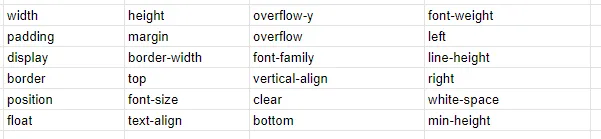
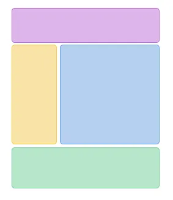
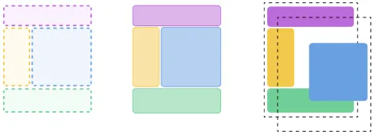

# Reflow, Repaint, Composite

**Reflow**, **Repaint** and **Composition** are the main steps responsible for rendering a page in a web browser. Understanding how they work and what triggers this or that process will allow you to create faster and more efficient web applications.

But before we get into a breakdown of these steps, let's run through the processes that take place before the page rendering begins, after the html page is received from the server:

1. HTML is parsed and parsed into tokens;
2. Tokens are converted into Nodes;
3. Nodes are assembled into a DOM (Document Object Model) tree;
4. In parallel with this process, CSS rules are parsed and CSSOM (CSS Object Model) is built;
5. CSSOM and DOM are combined into Render Tree, a DOM-like tree that hides non-visible elements (meta, script, link and display: none ) and adds elements that are not in the DOM (pseudo-elements :before, :after);
6. Next, the processes that this article focuses on begin: Reflow, Repaint, and Composition.

### Reflow / Layout

So, after the browser has defined the document structure and styles for each node, **Reflow** begins. Although it would be more correct to say **Layout** for the first operation, and all further repeated operations would be more correctly called **Reflow**. Sometimes this process is just called **Layout**, in all cases.

What happens at this stage? In order to render the elements on the page, the browser needs to understand how big these elements are and where they are located. The browser goes through the Render Tree, starting from the root element of the tree and determines the coordinates of each element and the space it occupies. This is how the Layout Tree is created. For elements with display: none, no calculations will be performed, however elements with visibility: hidden will participate in Layout/Reflow, as well as pseudo-elements that have a filled content property (div::before{content: ‘Hello’}), although they are not in the DOM. Determining the sizes and locations of elements is not done in a single pass through the tree, it can be done several times if elements occurring later affect previous elements. In general, this is a very complex procedure that requires significant computational resources.

Each time you change a style property that is responsible for the position and size of an element, the **Reflow** process is repeated to calculate the size and position of all elements that may be affected by the change. Both individual branches of the Render Tree and the entire tree can be **Reflowed**. The deeper the nesting of an element, the more elements will be affected by **Reflow**, so it is necessary to keep the structure of your document as flat as possible. Also, to reduce the number of Reflow operations, you should reduce the number of CSS rules and get rid of rules that you don't use.

Below is a list of the most popular properties whose change causes **Reflow**:

More complete list [http://goo.gl/lPVJY6](https://docs.google.com/spreadsheets/u/0/d/1Hvi0nu2wG3oQ51XRHtMv-A_ZlidnwUYwgQsPQUg1R2s/pub?single=true&gid=0&output=html).

**Reflow** is also often triggered when you try to get element metrics using JS (`elem.getBoundingClientRect()`, `elem.offsetLeft`, `elem.clientLeft`, etc.), perform scrolling or trigger event execution. Here you can read more about what operations in JS cause **Reflow**:

[https://gist.github.com/paulirish/5d52fb081b3570c81e3a](https://gist.github.com/paulirish/5d52fb081b3570c81e3a)

**Layout** / **Reflow** happens in the main browser thread, i.e. where JS is executed, Event Loop is running, etc. So when you have heavy JS code being executed, **Reflow** will be blocked, and as a consequence the interactivity of your page will also be blocked.

**Reflow** is visualised in this video:

<video width="640" height="360" controls>
  <source src="../assets/browser-001/reflow-visualize.mp4" type="video/mp4">
  Your browser does not support video playback.
</video>

### Paint / Repaint

The next step after **Layout/Reflow** is called **Paint** or **Repaint** for subsequent repetitive operations. The size and position of elements is not enough to render the page, you need to know how to ‘paint’ these elements. At the Paint/Repaint stage, the browser traverses the Layout Tree and creates a record of how the elements will be rendered on the page (x,y position, width, height, colour).

Just like **Layout/Reflow** is a resource intensive process, so for good responsiveness of your page, you should minimise operations that call **Repaint**. **Repaint** can be triggered by changes to the colour, background, visibility and similar properties, in general properties that do not change the size and position of the element, a more complete list can be found in this table [http://goo.gl/lPVJY6](https://docs.google.com/spreadsheets/u/0/d/1Hvi0nu2wG3oQ51XRHtMv-A_ZlidnwUYwgQsPQUg1R2s/pub?single=true&gid=0&output=html). If any of these properties are changed during animation, then **Repaint** of elements that were affected occurs and layers (more about this in the section about Composite) to which these elements belong are processed by GPU. You should also remember that every time **Reflow** is called, it will most likely be followed by **Repaint** of the element. That is, if you change the width property of an element, **Reflow** will occur and then Repaint the affected elements.

### Composite

Once the browser knows the size, position, and the order in which to paint the elements, it is time for the final rendering of the elements on the page. For this purpose, the browser at the **Composite** stage groups the various elements into layers, rasterises these layers, i.e. draws pixels and then combines these layers into a finished page in a separate compositor thread. All this is done to improve page performance. Now, when scrolling the page, you just need to move to the desired rendered layer and rejoin the layers in the compositor thread.

Since the size of layers can be quite large, the compositor flow also divides them into parts (Tiles) and draws first the parts that are currently visible in the browser window.

It is thanks to this step we get smooth animation of elements using such properties as `transform`, `opacity`. Elements that are animated using transform or opacity are placed on a separate layer. It is also possible to set the will-change property to the element, with this property we tell the browser that we plan to animate this element in the future, so it is put on a separate layer in advance. In the past, the `transform:translateZ(0)` or `transform:translate3d(0,0,0)` hack was used for this.

Since the **Composite** stage takes place in a separate thread of the compositor, not in the main thread, the calculations in JS do not affect it in any way. Even if the whole page hangs because of an infinite loop in JS, the animation that is implemented using transform, opacity will continue its execution.

Due to the fact that elements are located on separate layers, **Reflow** and **Repaint** for elements on one layer do not affect elements on other layers, but there are exceptions, for example, when z-index is incorrectly defined, you can read more here [https://blog.logrocket.com/eliminate-content-repaints-with-the-new-layers-panel-in-chrome-e2c306d4d752/](https://blog.logrocket.com/eliminate-content-repaints-with-the-new-layers-panel-in-chrome-e2c306d4d752/).

Don't forget that you can't abuse the composite step and create a layer for each element, as each layer uses memory to store each element. By abusing the will-change or transform properties, you can significantly increase the memory consumed by your page and as a result your page may simply stop working.

For working with layers, Chrome has a great Layers tool.

In this article I tried to tell you about **Reflow**, **Repaint**, **Composite** processes. After learning how they work, you can conclude how important it is to keep a flatter structure of your html document, minimise element changes and JS references, and why you should use transform, opacity, will-change properties for smoother animations.

