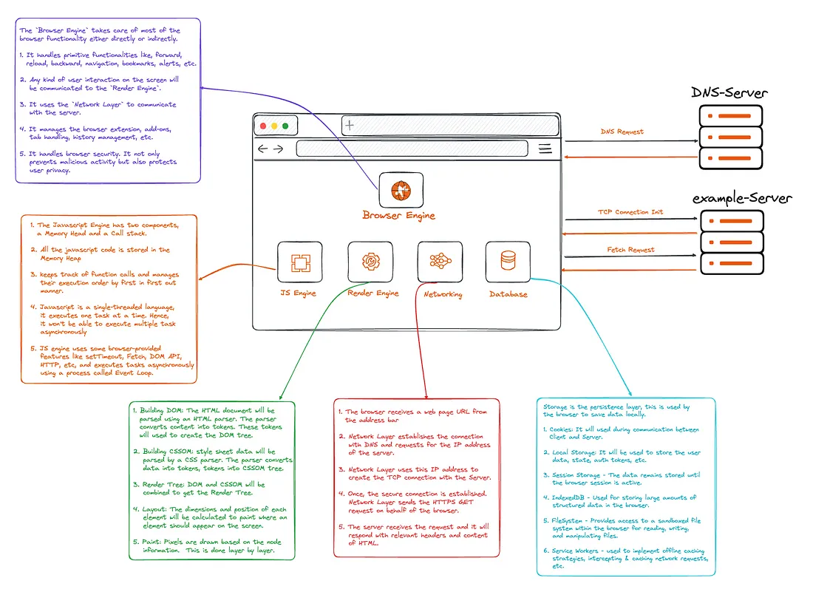
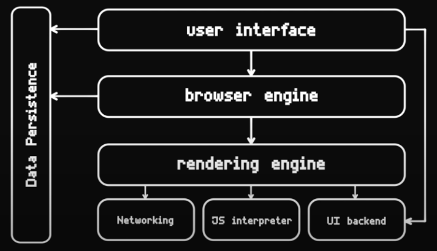
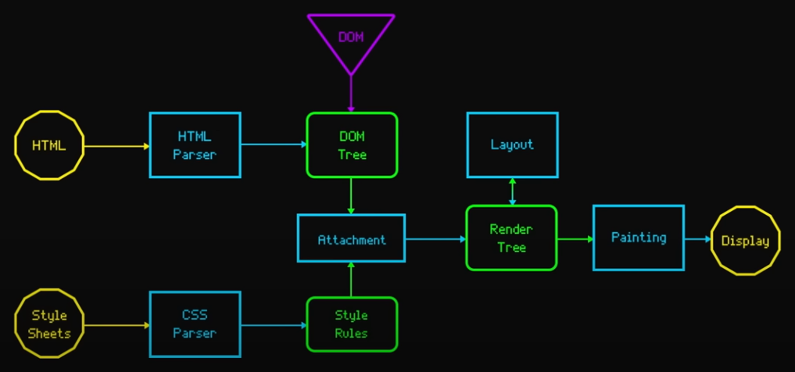

# How do Browsers Work?

Browser is the way to connect to the internet and access information from around the world. Every day millions of web pages are visited. If you are a web developer, you must know how these browsers work. Because this will help you optimize performance and improve the user experience.

#### Browser Overview

- Users request a web page by entering the URL in the address bar. If it is for the first time, the Browser sends the request to DNS (Domain Name Server) and gets the IP address of the place where the information is stored.
- Based on the IP address, It creates a secure TCP connection.
- The network layer sends the request to the Server to share the webpage resources.
- Server then verifies and analyses the request and sends the data (HTML, CSS, Javascript, Images, Fonts, etc.).
- The browser receives the data and using the Rendering Engine renders the web page content. If there is any script to be executed, the browser will use Javascript Engine to compile and execute.
- If any data needs to be persisted, that will be cached for further use (So that website performance can be increased by reducing the network calls). It could be for future Network requests or some data calculations.

The browser has a high-level Infrastructure and it has the following components:

- **User Interface**
- **Network Layer**
- **Browser Engine**
- **Rendering Engine**
- **Javascript Engine**
- **Data Storage Layer**

Browser has 4 basic steps to work:

- **Request**
- **Render**
- **Display**
- **Store**

### Request

Users request a web page by entering the URL in the address bar. The browser connects with the server and requests the page resource to display it on the screen.

So how does this connection and communication work in the browser?

This is handled by `Network Layer`. This is how it works under the hood.

#### Network Layer

When the browser receives a web page URL from the address bar, It checks if the requested page address is already there in the DNS cache, If not, Network Layer establishes the connection with DNS and requests for the IP address of the server.

Network Layer uses this IP address to create the TCP connection with the Server.

> If the TCP connection is established over HTTPS, one more roundabout trip happens with the server to build the secure connection, i.e. TLS/SSL. Here server and client decide what kind of cipher will be used to encrypt the communication and the server will send the digital certificate to confirm it’s identity. Once it is verified by the client. Secure connection is established.

Once, the secure connection is established. Network Layer sends the initial HTTPS `GET request` on behalf of the browser. Most often, an HTML file of the webpage is requested. The server receives the request and it will respond with relevant headers and content of HTML.

### Render

The server sends the data. It will be processed using the Render Engine and displayed on the screen. To process this data and display it on the screen, the browser takes the help of `Render Engine`.

#### Render Engine

`Render Engine` uses [Critical Rendering Path](https://medium.com/@ph_vinayak/what-is-the-critical-rendering-path-66c3a9bd9183) to convert data into pixels on the screen.

- The received HTML document will be parsed using an HTML parser. The parser converts content into tokens, using tokenization. These tokens will used to create the DOM tree. The DOM tree will have the nodes. These nodes contain the content and attributes of each element in the Document.
- Next up, style sheet data will be parsed by a CSS parser. The parser converts data into tokens, tokens into CSSOM tree. Though DOM Tree creation and CSSOM creation look similar, however, underneath both use different algorithms. CSSOM is a Tree of nodes with respective style data.
- By combining DOM and CSSOM a new tree called Render Tree is created. The Render tree will have all the elements except the element with `{display: none}` property. It is a hierarchy of nodes, and each node has content, style properties, and attributes to render the elements on the screen.
- Based on the availability of Elements in the Render Tree, the Layout process starts. In this process dimensions and position of each element will be calculated to paint where each element should appear on the screen.
- After the Layout, the Painting process starts, In painting, Pixels are drawn based on the node information. This is done layer by layer. These layers will be composed.

The rendering engine does this chunk by chuck. The moment it gets the data it will start the process of layout and painting. It will not wait until all the data is downloaded.

#### Javascript Engine

While parsing HTML document data, we will come across some blocking (Javascript) and non-blocking resources (CSS, fonts, images).

Non-blocking resources will be handled by parsers, whereas blocking resources, Javascript files, are compiled and executed by the `Javascript Engine`.

The `Javascript Engine` has two components, a Memory Head and a Call stack.

Memory Heap is the place where all the javascript code is stored.

The call stack is a stack data structure that keeps track of function calls and manages their execution order by **Last In First Out** manner.

Javascript is a single-threaded language, it executes one task at a time. If it gets multiple tasks, it won’t entertain until it finishes the existing task at hand.

The Javascript engine has to handle multiple tasks like I/O events, data fetching, etc, in such scenarios the task will get stuck and users can see a blank screen or a jank effect on the screen. This blocking issue can be handled by running these tasks asynchronously.

For that, the JS engine uses some browser-provided features like setTimeout, Fetch, DOM API, HTTP, etc., and executes tasks asynchronously using a process called Event Loop.

Learn More about [Event Loop Here](https://medium.com/@ph_vinayak/how-does-event-loop-work-understand-through-analogy-bc19eef631a9).

#### Display

#### User Interface:

Basically, it is about how the `User Interface` of any browser should look like. Such as the address bar, Forward/Backward buttons, Home Button, Bookmark menu, Input, etc. Over the period, after many iterations, the whole industry has come to a common design and specification. Along with these, we have a large viewport to display content fetched from the server.

#### Browser Engine:

The `Browser Engine` takes care of most of the browser functionality either directly or indirectly.

1. It handles primitive functionalities like, forward, reload, backward, navigation, bookmarks, alerts, etc.
2. Any kind of user interaction on the screen will be communicated to the `Render Engine`.
3. It uses the `Network Layer` to communicate with the server.
4. It manages the browser extension, add-ons, tab handling, history management, etc.
5. It handles browser security. It not only prevents malicious activity but also protects user privacy.

### Storage

`Data Storage Layer` is the persistence layer, which is used by the browser to save data locally. It could be used to cache data or persist the data or other usages.

There different types of storage are there such as:

- **Cookies** — This is key-value pair Javascript object data. It is stored in the browser memory. It has a max size of 5 MB. It will used during communication between Client and Server.
- **Local Storage** — Local storage is a key-value Javascript object. It has a maximum size of 50MB. It will be used to store the user data, state, auth tokens, etc. The stored data is not cleared, unless the user deletes it.
- **Session Storage** — Session storage data is a key-value pair javascript object and function. The data remains stored until the browser session is active. Once the browser is closed the stored data will be deleted. It has a max size of 5 MB.
- **IndexedDB** — Used for storing large amounts of structured data in the browser.
- **FileSystem** — Provides access to a sandboxed file system within the browser for reading, writing, and manipulating files.
- **Service Workers** — Service Workers are often used to implement offline caching strategies. It is used for intercepting and caching network requests, enabling offline functionality and performance optimizations in web applications.
