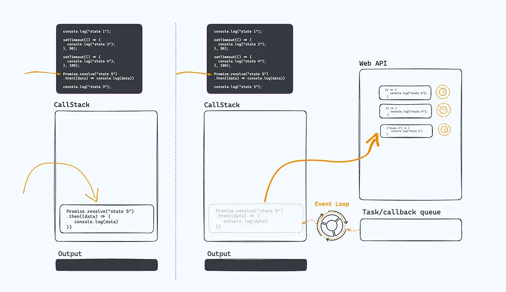

# How does Event Loop Work?

Javascript is required for every browser to function and manage its interactivity. The code is compiled and executed by the Javascript Engine within the browser. Javascript is a single-threaded language. It only handles one task at a time. If we assign another work, it won’t entertain until the current one is finished.

Imagine, you have a task that takes around 1 minute to complete, Javascript is true to its nature, it will not take another task until it finishes. In this case, the webpage will be stuck for a minute. And the user has to wait until it is completed. Imagine how frustrating it is to wait for a minute and stare at the blank screen.

To overcome this, the browser provides some features, that the Javascript engine doesn’t, those are Web APIs, such as setTimeOut, DOM API, HTTP requests, and so on. Using these we can achieve asynchronous and non-blocking behaviour.

Now the question is, how can we achieve this non-blocking behavior using provided Web APIs and others? Using Event Loop.

Before we understand the Event Loop we will see how code is executed in the Javascript Engine.

### How code is executed in the Javascript Engine?

Whenever the browser receives the Javascript file, it sends it to the Javascript Engine. The code will be stored in the Memory Heap. As the code starts executing, line-by-line code is pushed into the Call Stack. The Call Stack executes the code and returns the value, once the value is returned, that line of code will be popped out.

Let’s see an example:

```javascript
function foo(){
  console.log("state 1")
  console.log("state 2")
  console.log("state 3")
}

foo()
```

When the code executes, `foo()` function will be pushed into the Call Stack and then it will be executed. `foo` has 3 console statements. the first statement is pushed into the Call Stack, since it is straightforward, it will be executed and return the output “state 1” and it'll be popped out. The second statement will pushed into the stack, executed, and then popped out. similarly, the last statement will be pushed into the stack, executed, and popped out of the stack. Finally, function `foo` will be popped out of the Call Stack.

1/5 — Function foo is pushed to the CallStack.


2/5 — The first statement is pushed and executed. Once it prints the value, it will be popped out of the Call Stack.


3/5 — The second statement will be pushed, and executed. Once it returns the value, it is popped out.


4/5 — similarly the last statement.


5/5 — Finally, once all the lines of code are executed, function foo will be popped out of the Call Stack.


### Event Loop — When code has `setTimeOut`.

```javascript
console.log("state 1");

setTimeout(() => {
  console.log("state 2");
}, 100);

console.log("state 3");
```

When the Javascript engine receives this code, the first statement will be pushed into the stack. Since it is a simple console function it will be executed and output will be returned. i.e. “state 1” and popped out of the Call Stack. Now, the second statement will be pushed into the Call Stack. This time, the setTimeout function is Web API, it will given to the Browser Engine to execute. so, this statement will be popped out. Next, 3rd statement will pushed into the Call Stack. it will be executed and popped out of the stack.

We know, we have given one statement to the browser to execute. The browser runs the timers for 100 ms and then it will return the callback function. This callback function will not be directly moved to the Call Stack. Instead, it will be moved to the callback queue. The queue works on a first come first serve principle. The statements which are sent to the browser to execute will all be stored in the queue. Once the call stack is empty, The Event Loop takes the first statement from the queue stack and pushes it to the Call Stack.

Call Stack executes the function, returns values, and then the function will be popped out. Now, Event Loop checks the Call Stack, If the Call Stack is empty, it will take the first item from the queue stack and pushed to the Call Stack. The Call Stack continues its work.

1/4 — The first statement will be pushed to Call Stack and executed. Once the value is printed, it will be popped out.


2/4 — The second statement will be pushed, Since, it is part of the Web API, it will sent to Browser Engine to handle the execution.


3/4 — Now, the last statement will be pushed, executed and once the value is printed it will be popped out of the Call Stack.


4/4 — Event Loop checks the Call Stack, If the Call Stack is empty, it will take the first item from the queue and pushed to the Call Stack. The Call Stack continues its work.


Here is the output of the code:

```plain
state 1
state 3
state 2
```

### When code has `setTimeOut` and `Promise` both.

The Event Loop’s main function is to check whether the Call Stack is empty or not, If it is empty, push the first item from the queue to the Call Stack until the queue stack is empty.

You might be saying this is for setTimeout, but what about for the Promises? Promises also take time to execute.

Well, In this case, Event Loop works a little bit differently. But not completely different. It just sets different priorities for Promise kind of items.

Let’s see the last example with the promise code.

````javascript
console.log("state 1");

setTimeout(() => {
  console.log("state 2");
}, 10);

setTimeout(() => {
  console.log("state 4");
}, 100);

Promise.resolve("state 5").then((data) => console.log(data))

console.log("state 3");
````

In this example, the first statement will be pushed to the Call Stack, executed, and popped out of the Call Stack. Now, the second statement will be pushed to the stack, since is setTimeOut, It will be sent to the browser to handle by popping out of the Call Stack. Next, the 3rd statement will be pushed to the Call Stack, which is also web API, and it will be given to the browser to execute. The fourth statement is Promise, Promise is pushed to the stack. It will be sent to the browser engine to handle it by popping out of the Call Stack. Finally, the console statement is pushed, executed, and popped out of the stack.

Now, in the event loop side, The setTimeout functions will be executed and both the callback functions will be pushed to the task queue. Promise will be executed, and it’s `.then()` function will be pushed to another queue i.e. micro-task queue.

In the Event Loop, we have a Macro-task queue/callback queue(The normal queue we use for the tasks) and a Micro-task queue. Micro-task queue has the highest priority, hence the items in the micros-task will be handled first and then the Macro-task. For every Macro-task queue item, all the items in the micro-task queue will handled. Hence, promise callback will addressed first.

Once the Micro-task queue is empty, Event Loop checks whether the Call Stack is empty or not, if it is empty, it will push the items from the Macro-task queue and the Call Stack executes it and pops out of the Call Stack.

Here is the output:

```plain
state 1
state 3
state 5
state 2
state 4
```

1/8— The first statement will be pushed to Call Stack and executed. Once the value is printed, it will be popped out.


2/8 — The second statement will be pushed, Since, it is part of the Web API, it will sent to Browser Engine to handle the execution.


3/8— The third statement will be pushed, Since, it is also a part of the Web API, it will sent to Browser Engine to handle the execution.


4/8— The fourth statement will be pushed, Since, it is also a part of the Web API, it will sent to Browser Engine to handle the execution.



5/8— Now, the last statement will be pushed, executed and once the value is printed it will be popped out of the Call Stack.


6/8 — The setTimeout functions will be executed as per the delay provided, and the callback functions will be pushed to the task queue. Promise will be executed, and it’s `.then()` function will be pushed to another queue i.e. micro-task queue.


7/8 — Micro-task queue has the highest priority, hence, the items in the micros-task will be handled first. Event loop pushes the Micro-task queue item into the Call Stack. It will be executed and popped out of it.


8/8 — Once the Micro-task queue is empty, Event Loop picks functions from the Macro-task queue and pushed them to the Call Stack. The Call Stack executes functions and pops out of the it.


### Understand Event Loop in Layman terms?

Imagine a big condiment shop with a nice setup of a front counter and kitchen at the backend to prepare items like sandwiches, omelets, Maggie, etc. All the items on the front counter are sold, such as Biscuits, snacks, tea, and other food items like sandwiches, omelets, and Maggie.

It is a busy shop and orders are handled in a queue. The person sitting at the counter takes care of it and he will be very busy handling them.

Whenever he receives an order, he checks, whether the order is delivered immediately or it takes time. If it is delivered immediately it will be served by him. For example, cigarettes or snacks.

If he receives orders like, omelettes, Maggie, or Sandwiches, he knows that it will take time to prepare and deliver. So, he shouts at the kitchen and asks people in the kitchen to prepare. Since he is very busy, he can not track whether the order is ready or not. For that, he keeps an Assistant. His job is to check whether the person on the counter is done with his order handling or not. If he is done will all, then he gives a prepared order to him. He never disturbs him while he was handling the orders.

This assistant has a queue system. Whenever the order is prepared from the kitchen, he keeps it in his queue and based on the order in which it is queued, he will give it to the person on the counter to complete the take order.

If you could see the whole process.

The person who is sitting on the counter and executing the order -> Call Stack.

The kitchen in which items are prepared is -> WebAPIs

The assistant who is helping the person on the counter is -> Event Loop.

The queue he is managing to stack the order is -> callback queue

The assistant can keep other sub-assistant a man and a woman.

The assistant is a kind of womanizer, he always prefers orders that are on the woman’s side. And those will be delivered first. If a woman’s side orders are emptied, then man’s side orders will be served to the counter.

Man sub-assistant is → Macro-task queue

Women sub-assistant is -> Micro-task queue
