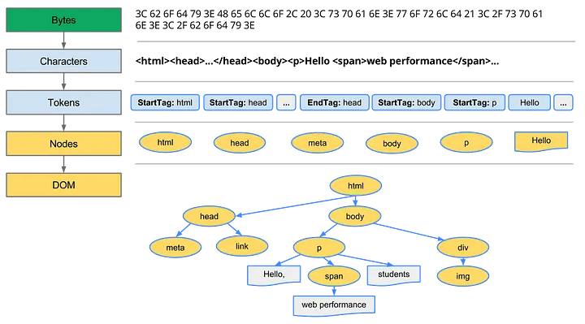
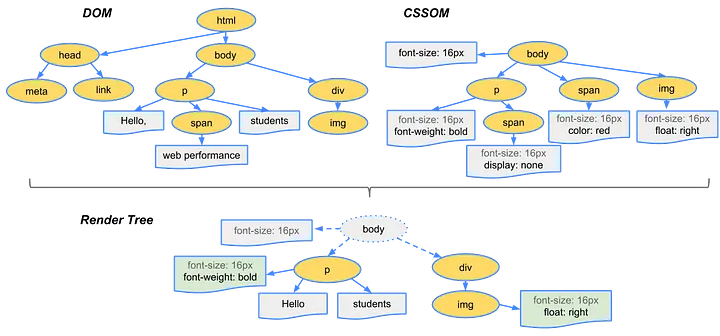

# What is Critical Rendering Path?

Users predominantly care about a fast and smooth experience when using web applications. If they don’t get these two they won’t visit that website. Research also suggests that web page loading speed and experience are directly related to the customer conversion rate. The higher the page loading speed, the higher the customer conversion.

In one research, Walmart found that for every 1-second improvement in page load time, conversions increased by 2%.

To understand how webpage performance can be optimized, we must understand how a webpage is created on any browser. To understand this, we need to know What is Critical rendering path.

So, What is the Critical Rendering Path or CRP?

A critical rendering path is the step-by-step process carried out to convert HTML, CSS, and JS files into pixels on the screen.

This process has five steps.

1. DOM construction.
2. CSSOM construction.
3. Render Tree Creation.
4. Layout Process.
5. Painting.

### DOM construction

When the user enters the URL in the address bar, the browser sends a request to the server for an HTML page. The server fulfills the request by sending back an HTML page in the response.

The rendering engine uses the HTML parser to parse the HTML file. The HTML file data will be converted to tokens using the tokenization process.

consider the below HTML file data.

```html
<html>
 <head></head>
 <body>
  <h1 class='cl-head'> Heading </h1>
  <p id ="i-para"> paragraph data </p>
 </body>
</html>
```

The tokenizer will convert data into tokens.

```plain
StartTag:html, StartTag:head EndTag:head, StartTag:body, StartTag:h1, Heading,
EndTag:h1, StartTag:p, paragraph data, EndTag:p, EndTag:body, EndTag:html
```



Once the tokenization process is over. Tokens created in the tokenization stage will used to create the DOM. Each token will be processed and a node will be created based on the occurrence. Each node will have respective data and attributes. This is how the DOM tree is created.

One thing we need to notice, when we request data, the server sends it chunk by chunk, so the DOM will be constructed incrementally with available data.

### CSSOM Construction

While parsing HTML data, if the parser encounters the `link` or `style` tags, the browser will initiate the request for the CSS file, and if there are embedded styles within the `style` tags, those will be available readily. These CSS data will be parsed using CSS parsers. This involves tokenizing the CSS, parsing it into a hierarchical structure of nodes with respective properties and values, and creating the CSS Object Model.

CSSOM won’t be constructed incrementally, like how DOM is created.

Let’s assume we created the CSSOM tree using partial CSS data, and it has a value of `.h1 { color: white, background: purple }`. When we render it. It will have a `Purple` background color.

However, We have a `h1` value in the CSS file which is not yet requested and it will override the initial value.

If we render this partial CSSOM tree, the rendered page will have a purple background. This is not an expected style. Hence CSSOM tree will be rendered once all the CSS data is parsed

Therefore, **CSSOM** construction is **RENDER BLOCKING**.

One thing to note here, while HTML parsing, if the parser encounters style tags it will make a request and it won’t block the parsing. But what if it encounters `script` a tag?

When parser encounters `<script>` tag, the browser will request the JS file. The gotcha here is, that the model of the web is synchronous, whenever the parser encounters the script tag, The parsing will be stopped until the file is downloaded, compiled, and executed by the JS engine. This will create a blank screen on the window.

So how do we handle it?

We need to use `async` or `differ` attribute in the script tag. These kinds of operations will be executed asynchronously, so they will be parsed and executed in a separate thread.

To handle such requests we have a Speculative Parser. This will only work for external resources that need to be parsed, such as scripts, images, or styles. BTW, it doesn’t modify the DOM tree.

### Render Tree Construction

Once the DOM and CSSOM are constructed, a new tree will be created by combining both Object Models, and it is called a Render Tree. The render tree will have all the node elements, except node value with `{display: none}`. However, the node with the `{display: hide}` value will be included.



### Layout Process

Once the render tree is ready, the Layout process will start. In the layout process, the render engine determines where and how each element of the render tree should be drawn. How much space should be consumed in a given real estate?

The size of the real estate depends on the viewport of the device. If we don’t mention it will take 960px by default. If we want to change the size based on the device we should mention it in the header tag of the HTML as `<meta name="viewport" content="width=device-width">` This will help the render engine to consider the viewport of the device before calculating the size and location for each element.

The layout performance depends on the complexity of the render tree structure and complexity. The more the number of nodes, the more it will take time to Layout the elements. It also depends on the changing dimensions and locations, hence avoiding scrolling or animation during this process will improve the layout performance. Also, by considering the batch update we can improve the performance.

### Paint

This is the last step of the Rendering Path. In this step, Pixels will be painted on the places determined during the layout process. It involves the conversion of boxes or shapes into pixels and this process is called rasterization.

Often a painting is done on a single surface, however, the render engine does it on different layers. Later these layers will be combined and this process is called layer composition.

The painting of the layers will happen on the CPU and these layers will be uploaded to the GPU to compose them into a single layer.

When there are dynamic changes such as adding extra DOM, changing the position of an element, or changing the font size will cause relayout (reflow), repaint, and invalidation of the cache. Browsers normally try to do minimal possible action in response to changes.


In all these stages there is a chance of introducing delay. Understanding each stage we can optimize the performance of the website.

### How to Optimize the CRP?

1. Identify critical resources in the downloading process.
2. Prioritize downloading critical assets over non-critical ones.
3. Use techniques like async or defer tags for non-critical assets such as JS files or images.
4. Decrease the size of critical assets to reduce the number of requests.
