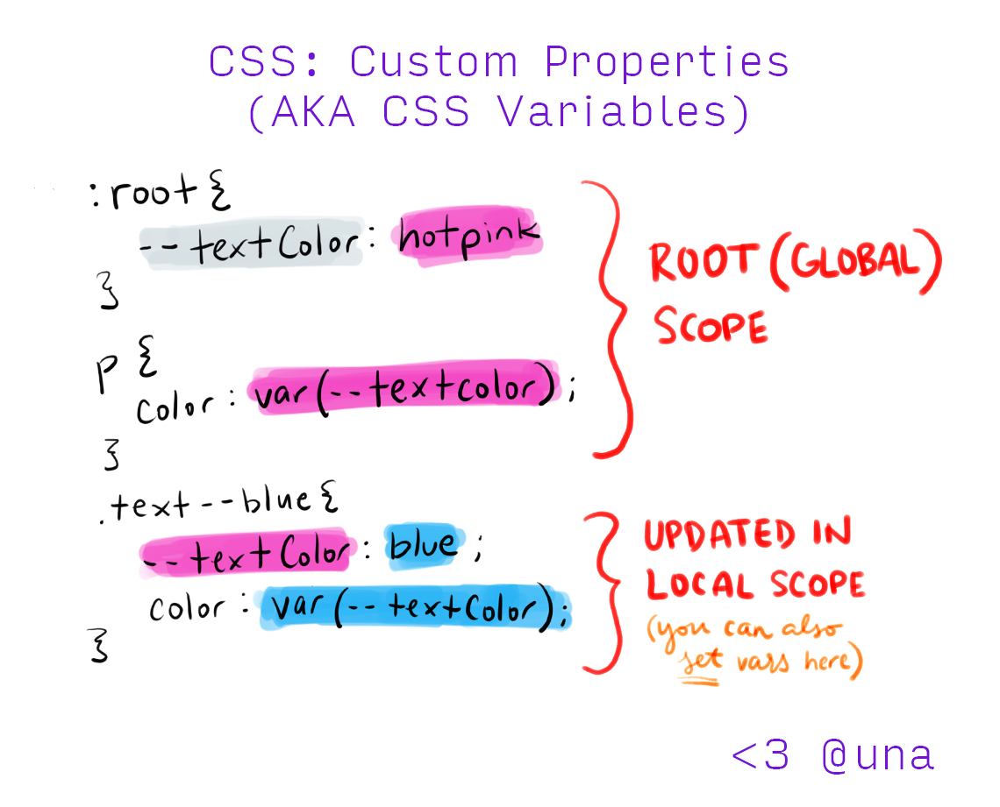
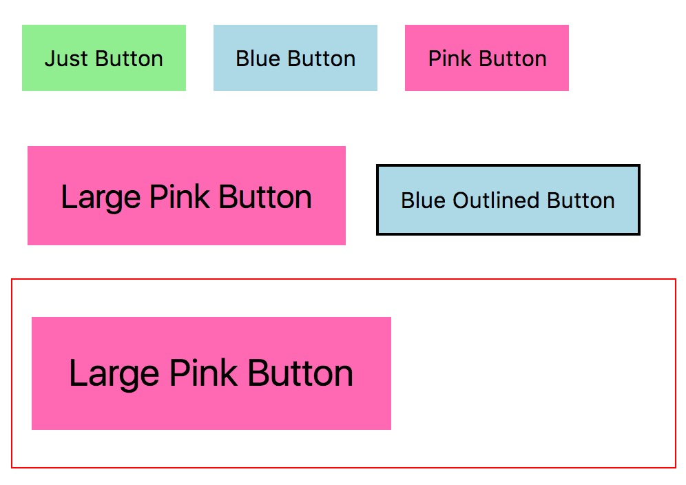

# Locally Scoped CSS Variables: What, How, and Why

CSS Custom Properties (also popularly called CSS Variables) are [here](https://caniuse.com/css-variables). Variables that can be updated and altered dynamically in the file. While we had “variables” with pre/post-processors (like Sass and PostCSS), these “variables” got compiled into CSS and didn’t have dynamic capabilities to update their content. This isn’t true with CSS variables, which truly store updateable values.

The way you set CSS variables is with a pre-pended `--` and the way you access them is via `var(--varName)`. In a very elemental way, you can write the following to use a CSS variable that declares the text color to be red:

```css
div {
    --color: red;
    color: var(--color);
}
```

### CSS Variables

Let's talk for a moment why dynamic CSS Variables are so much better than what we’ve had before.

#### Dynamic JavaScript + CSS

With CSS variables, we can now more easily update values that we determine through JavaScript. This means we don’t have to use inline property styles or update class names. We can simply pass values into our CSS variables instead.

To pass values into the `:root`, one can do the following:

```javascript
document.documentElement.style.setProperty('--varName', 'propValue')
```

This writes and/or updates the value to the root of your CSS file. So, if I wanted to update the width of a loader bar to represent the percentage of load time, I could do something like this:

```javascript
function calculateLoadProgress() {
  let loadProgress = 0;

  // Codes to update loadProgress here

  return loadProgress;
}

// Set width of progress bar
document.documentElement.style.setProperty('--progressBarWidth', calculateLoadProgress());
```

#### Dynamic Property Fragments

Another note that’s really cool about CSS variables is how specific we can get within property values. While we previously had to use separate declarations for border properties, we now can use variables to update any portion of a property, including shorthand properties like the border and properties that accept an unknown argument list like drop-shadow and gradients.

Take this example:


```css
.button-gradient {
  background: linear-gradient(var(--gradientAngle), var(--gradientStart), var(--gradientStop));

  --gradientAngle: 60deg;
  --gradientStart: lightpink;
  --gradientStop: lightyellow;
}

.button-gradient:hover {
  --gradientAngle: 0deg;
}
```

We’re updating the `--gradientAngle` and not the entire background property. We can also do this with JavaScript and update these values as the user interacts with any element 😎.

#### Cleaner Components

CSS variables also allow us to write modular code with modifiers in a cleaner way. A typical example for components are multi-style buttons, so let’s stick with those. Take a look at the following example:

__

Traditionally, with a naming convention like BEM, we would set classes via a pre/post processor, and then make modifier classes to override the base classes:

```scss
// Variables
$primaryColor: lightgreen;
$buttonBgColor: $primaryColor;

// Base Class
.button {
  background: $buttonBgColor;
  // other properties
}

// Modifier Class
.button--blue {
  background: lightblue;
}
```

In the example above, we’re writing a property to override a previously stated property, increasing specificity, file weight, and cluttering our codebases. But with CSS Variables, we **no longer need to override entire base style properties.** We just update their variables.

It can look something like this:

```css
/* Variables */
:root {
  --primaryColor: lightgreen;
  --buttonBgColor: var(--primaryColor);
}

/* Base Class */
.button {
  background: var(--buttonBgColor);
}

/* Modifier Class */
.button--blue {
  --buttonBgColor: lightblue;
}
```

### We Can Do Better with Local Scope

This is a great way to set global variables, but isn’t a necessity. CSS variables don’t need to be declared only in the `:root`—they can be declared at any point in the CSS file, and live within the scope at which point they are specified. This is similar to JavaScript variables instantiated with the `let` keyword, which take the scope of their containing block (`{}`) (aka block scope). So we can leverage this specificity in our component styling declarations.

**Leveraging CSS Variable scope improves the size, specificity, & semantics of our stylesheets.** That’s a lot of alliteration!

For example, `--buttonBgColor` isn’t something we needed to put in `:root` as a global variable (in the earlier example). A cleaner approach would be to rename that variable to just `--bgColor` and place it within the `<button>` component. This makes it more tightly coupled with its parent component, and makes more semantic sense in its ordering within the CSS file.



> CSS Custom Properties are scoped to their containing blocks (`{}`), just like JavaScript variables instantiated with the *let* keyword.

A good general rule is as follows: **Use local CSS variables until you need a global variable**. Then, work your way up the tree. This reduces a massive list of CSS variables from piling up in your `:root` and makes the code much cleaner when building design systems and custom properties.

### Organization & Example Time

With Sass, we can extend this idea use the nested `&` to rewrite it a little bit cleaner and more visually object-oriented. This is where we can see a neat structure emerging, broken up by:

1. Default styles (property specification)
2. Default values (base variables)
3. Variances (updated variables)

```scss
.button {
  // 1. Default Styles
  background: var(--bgColor);
  padding: var(--size);
  line-height: var(--size);
  border: var(--outline);
  font-size: var(--size);
  
  // 2. Default Values
  --bgColor: lightgreen;
  --outline: none;
  --size: 1rem;
  
  // 3. Variances
  &--blue {
    --bgColor: lightblue;
  }
  
  &--pink {
    --bgColor: hotpink;
  }
  
  &--large {
    --size: 1.5rem;
  }
  
  &--outlined {
    --outline: 2px solid currentColor;
  }
}
```

Note: We can and should still leverage `:root` for global variables, like base color styling and sizing resets, but locally scoped variables reduce specificity, thereby reducing size, and also increase semantics.

### Default Values

It’s also interesting to note that you can use default values to stub variables in case they don’t exist yet. `var()` gives us this capability by accepting two arguments (and can be nested within itself). In the example below, if `--bgColor` is not defined, the card will take the primary color (red). So we can potentially remove step 2 from the base style for `.button` and just update `--bgColor` in the modifiers (if we wanted the base button to be the primary color).

```css
/* 0. Set global variables here */
:root {
  --colorPrimary: red;
}

.button {
  /* 1. Default Styles */
  /* If --bgColor is not defined, the background will be the fallback: red */
  background: var(--bgColor, var(--colorPrimary));
  
  /* 2. Default Values */
  /* Since --bgColor is defined, the button remains lightgreen */
  /* If the line below was missing, the button would be red */
  --bgColor: lightgreen;

  /* ... */
}
```

### Theming with the Trailing &

If we have more complex components, we can still use this technique, and to make it even more concise, we can combine this with a CSS preprocessor like Sass. Theming buttons inside of card components using the Sass **trailing ampersand** technique can work like so:

```scss
.button--large {
  .card & {
    --size: 1.7rem;
  }
}
```

This would make all large buttons have a slightly bigger `--size` within a card component than they would in any other place. The trailing ampersand allows us to style directly within the element block and outputs to:

```scss
.card .button--large {
  --size: 1.7rem;
}
```

So just to demonstrate with our example, lets give `.card` a red border and apply it the above code. We can see that the large pink button is even larger within our makeshift card.



```html
<div class="card">
  <button class="button button--pink button--large">
    Large Pink Button
  </button>
</div>
```
