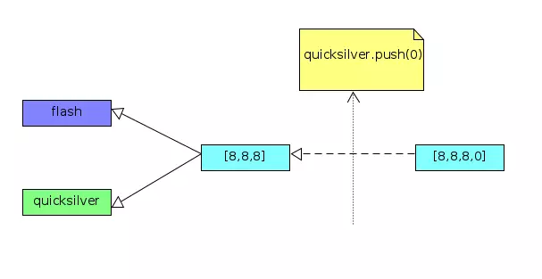
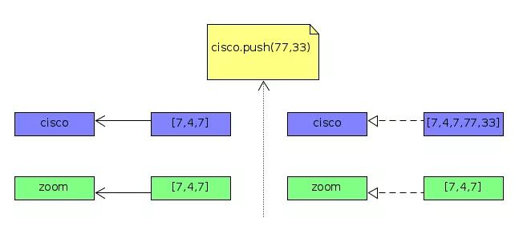

# How JavaScript References Work

There are NO pointers in JavaScript and references work differently from what we would normally see in most other popular programming languages. In JavaScript, it’s just NOT possible to have a reference from one variable to another variable. And, only compound values (e.g.. Object or Array) can be assigned by _reference_.

The following terms are used throughout the article:

- **scalar** – a singe value or unit of data (e.g. integer, boolean, string)
- **compound** – comprised of multiple values (e.g. array, object, set)
- **primitive** – a direct value, as opposed to a reference to something that contains the real value.

JavaScript’s scalar types are primitives, but some languages, such as Ruby, have scalar reference types. Note that in JavaScript, the scalar primitive values are immutable while compound values are mutable.

### Bottom Line

- The _typeof_ value assigned to a variable decides whether the value is stored with _assign-by-value_ or _assign-by-reference_
- On variable assignment, the scalar primitive values (number, string, boolean, undefined, null, symbol) are _assigned-by-value_ and compound values (object, array) are _assigned-by-reference_
- The references in JavaScript only point at contained values and NOT at other variables or references
- In JavaScript, scalar primitive values (number, string, boolean, undefined, null, symbol) are _immutable_ and compound values (object, array) are _mutable_

### A quick example of assign-by-value

In the code snippet below, we are assigning a scalar primitive value (number) to a variable and thus _assign-by-value_ applies here. Firstly, the variable `batman` is initialized and when the variable `superman` is assigned with the value stored in the variable `batman`, it creates a new copy of the value and stores it. When the variable `superman` is modified, variable `batman` is left unaffected as they point to distinct values.

```javascript
var batman = 7;
var superman = batman; // assign-by-value

superman++;

console.log(batman); // 7
console.log(superman); // 8
```


### A quick example of assign-by-reference

In the code snippet below, we are assigning a compound value (array) in a variable and thus _assign-by-reference_ applies here. The variables `flash` and `quicksilver` are references to the same value (aka shared value). The references will point to the updated value when the shared value is modified.

```javascript
var flash = [8, 8, 8];
var quicksilver = flash; // assign-by-reference

quicksilver.push(0);

console.log(flash); // [8, 8, 8, 0]
console.log(quicksilver); // [8, 8, 8, 0]
```



### How to create a new reference?

When the compound value in a variable is reassigned, a new reference is created. In JavaScript, unlike in most other popular programming languages, the references are pointers to values stored in variables and NOT pointers to other variables, or references.

```javascript
var firestorm = [3, 6, 3];
var atom = firestorm; // assign-by-reference

console.log(firestorm); // [3, 6, 3]
console.log(atom); // [3, 6, 3]

atom = [9, 0 ,9]; // value is reassigned (create new reference)

console.log(firestorm); // [3, 6, 3]
console.log(atom); // [9, 0, 9]
```


### How References Work When Values Are Passed as Function Parameters

In the code snippet below, the variable `magneto` is a compound value (an Array), thus it is assigned to variable (function argument) `x` as a reference.

The `Array.prototype.push` method invoked inside the IIFE mutates the value in the variable `magneto` via a JavaScript reference. But, the reassignment of variable `x` creates a new reference and further modifications to it do NOT affect the reference to the variable `magneto`.

```javascript
var magneto = [8, 4, 8];

(function(x) { // IIFE
    x.push(99);
    
    console.log(x); // [8, 4, 8, 99]
    
    x = [1, 4, 1]; // reassign variable (create new reference)
    x.push(88);
    
    console.log(x);  // [1, 4, 1, 88]
})(magneto);

console.log(magneto); // [8, 4, 8, 99]
```

### How to change the original value in a compound variable passed as a function argument through JavaScript reference?

The solution here would be to modify the existing compound value where the reference is pointing to. In the code snippet below, the variable `wolverine` is a compound value (Array object) and on IIFE invocation, the variable (function argument) `x` is assigned by reference. The `Array.prototype.length` property can be used to create an empty array by setting its value to `0`. Thus, the variable `wolverine` is changed to the new value set in a variable `x` through JavaScript reference.

```javascript
var wolverine = [8, 7, 8];

(function(x) { // IIFE
    x.length = 0; // make empty array object
    x.push(1, 4, 7, 2);
    
    console.log(x); // [1, 4, 7, 2]
})(wolverine);

console.log(wolverine); // [1, 4, 7, 2]
```

### How to store a compound value through assign-by-value?

The solution here would be to make a manual copy of the compound value and then assign the copied value to a variable. Therefore, the reference of the assigned value does NOT point back to the original value. The recommended approach to creating a (shallow) copy of the compound value (Array object) is to invoke `Array.prototype.slice` method on it with no arguments passed.

```javascript
var cisco = [7, 4, 7];
var zoom = cisco.slice(); // create shallow copy

cisco.push(77, 33);

console.log(zoom); // [7, 4, 7]
console.log(cisco); // [7, 4, 7, 77, 33]
```



### How to store a scalar primitive value through assign-by-reference?

The solution here would be to wrap the scalar primitive value in a compound value (Object, Array) as its property value. Thus, it can be assigned-by-reference. In the code snippet below, the scalar primitive value in the variable `speed` is set as a property on the object `flash`. Therefore, it is assigned-by-reference on IIFE invocation to the variable (function argument) `x`.

```javascript
var flash = { speed: 88 };

(function (x) { // IIFE
  x.speed = 55;
})(flash);

console.log(flash.speed); // 55
```

### An aside

In JavaScript, the scalar primitive values are _immutable_ while compound values are _mutable_.

```javascript
var captainCold = 12;
var legendsTomorrow = { member: captainCold };

legendsTomorrow.member++; // 13
console.log(captainCold); // 12
```
