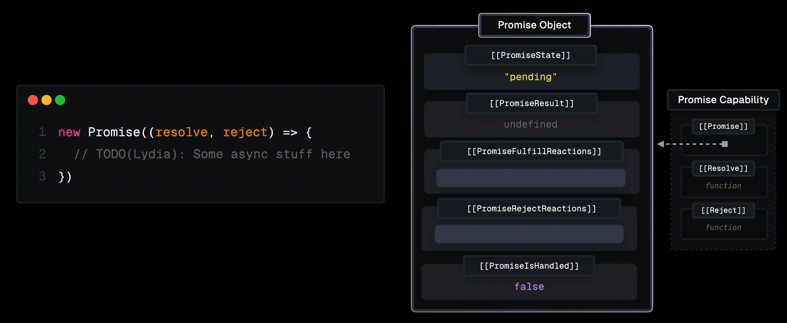
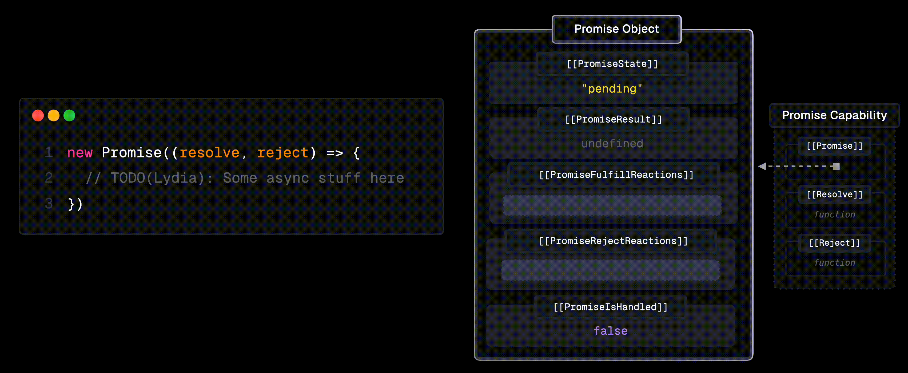
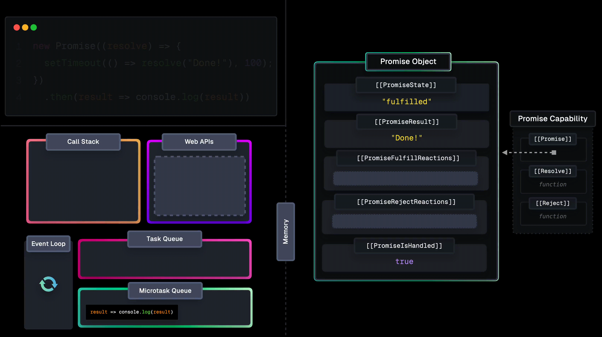

# Promise Execution

We'll dive deep into some of the inner workings of promises and explore how they enable non-blocking asynchronous tasks in JavaScript.

---

One way to create a promise is by using the `new Promise` constructor, which receives an executor function with `resolve` and `reject` arguments.

```javascript
new Promise((resolve, reject) => {
   // TODO: Some async stuff here
});
```

When the Promise constructor is invoked, a few things happen:

- A [Promise Object](https://tc39.es/ecma262/#sec-properties-of-promise-instances) is created.
  This Promise Object contains several internal slots, including the `[[PromiseState]]`, `[[PromiseResult]]`, `[[PromiseIsHandled]]`, `[[PromiseFulfillReactions]]`, and `[[PromiseRejectReactions]]`. 
- A [Promise Capability Record](https://tc39.es/ecma262/#sec-promisecapability-records) is created.
  This "encapsulates" the promise and adds some additional functionality to resolve or reject the promise. These are functions that control the eventual `[[PromiseState]]` and `[[PromiseResult]]` of the promise, and kick off asyncrhounous tasks.


We can resolve this Promise by calling `resolve`, which is available to us through the executor function. When we call `resolve`:

1. `[[PromiseState]]` is set to `"fulfilled"`
2. `[[PromiseResult]]` is set to the value we passed to `resolve` which is `"Done!"` in this case.



The process is similar when calling `reject`, now the  `[[PromiseState]]` is set to `"rejected"`, and the `[[PromiseResult]]` is set to the value we passed to reject, which is `"Fail!"`.



What's so special about using functions to change some internal properties within an object?

The answer lies in the behavior associated with the two internal slots we've so far skipped: `[[PromiseFulfillReactions]]` and `[[PromiseRejectReactions]]`.

---

The `[[PromiseFulfillReactions]]` field contains Promise Reactions. This is an object created by chaining a `then` handler to the Promise.  

This Promise Reaction contains, among other fields, a `[[Handler]]` property that holds the callback we passed to `then`. When the promise resolves, this handler is added to the `Microtask Queue` and has access to the value with which the promise resolved. 


When the promise resolves, this handler receives the value of `[[PromiseResult]]` as its argument, after which it's pushed to the `Microtask Queue`. 

This is where the asynchronous part of promises comes into play! 


> The `Microtask Queue` is a specialized queue in the event loop.  When the `Call Stack` is empty, the event loop first processes tasks waiting in the `Microtask Queue` before handling tasks from the regular `Task Queue` (also called "callback queue" or "macrotask queue").
> 

Similarly, we can create a **Promise Reaction** record to handle promise rejection by chaining `catch`. This callback will get added to the `Microtask Queue` when the promise rejects.


---

So far, we've only called `resolve` or `reject` directly within the executor function. Although that's _possible_, it doesn't leverage the full power (and primary purpose) of Promises!

In most cases, we'll want to `resolve` or `reject` are some later point in time,  typically when an asynchronous task completes.

Asynchronous tasks happen off the main thread, such as reading a file (e.g. `fs.readFile`), making network requests (e.g. `https.get` or `XMLHttpRequest`) or something as simple as timers (`setTimeout`).


When those tasks complete at some unknown time in the future, we can use the callback that such async operations typically provide to either `resolve` with the data that we got back from the async task, or `reject` if an error occurred.

---

To visualize this, let's go through the execution step-by-step. To keep this demo simple but still realistic, we'll use a `setTimeout` to add some async behavior.

```javascript
new Promise((resolve) => {
  setTimeout(() => resolve("Done!"), 100);
}).then(result => console.log(result))
```

First, the `new Promise` constructor is added to the `Call Stack` and creates the Promise Object.


Then, the executor function is executed. On the first line within the function's body, we call `setTimeout`, which is added to the `Call Stack`.

`setTimeout` is responsible for scheduling the timer in the Timers `Web API` with a delay of 100ms, after which the callback that we passed to `setTimeout` will be pushed to the `Task Queue`.


> This asynchronous behavior here is related to `setTimeout`, not related to promises. I'm just showing this here to show a common way that promises are used - to resolve a promise after some delay.
>
> However, the delay itself is not caused by promises. Promises are designed to work with asynchronous operations, but those asynchronous operations can come from different sources like timers or network requests.

After the timer and constructor are popped off the `Call Stack`, the engine encounters `then`.

then is added to the `Call Stack`, and creates a **Promise Reaction** record,  which handler is the code that we passed as a callback to the `then` handler.

Since the `[[PromiseState]]` is still `"pending"`, this **Promise Reaction** record is added to the `[[PromiseFulfillReactions]]` list.


After the 100ms have passed, the `setTimeout` callback is pushed to the `Task Queue`.

The script had already finished running so the `Call Stack` is empty. There's also nothing on the `Microtask Queue`, meaning that this task is now taken from the `Task Queue` onto the `Call Stack`, the callback is executed and calls `resolve`.


Calling `resolve` sets the `[[PromiseState]]` to `fulfilled`, `[[PromiseResult]]` to `Done!`, and the code associated with the **Promise Reaction**'s handler is added to the `Microtask Queue`.

`resolve` and the callback are popped off the `Call Stack`.


Since the `Call Stack` is empty, the event loop first checks the `Microtask Queue` where the `then` handler's callback is waiting.

The callback is now added to the `Call Stack`, and logs the value of `result`, which is the value of `[[PromiseResult]]`; the string `Done!`.



Once the callback finishes executing and is popped off the `Call Stack`, the program has completed!

---

Besides creating a **Promise Reaction**, `then` also returns a Promise. This means that we can chain multiple `thens` to each other, for example:

```javascript
new Promise((resolve) => {
  resolve(1)
})
  .then(result => result * 2)
  .then(result => result * 2)
  .then(result => console.log(result));
```

When this code executes, a **Promise Object** is created when the `Promise` constructor is called. After that, whenever the engine encounters a `then`, both a **Promise Reaction** record and a **Promise Object** are created.

In both cases, the `then` callbacks multiply the received value of `[[PromiseResult]]` by two. The `then`'s `[[PromiseResult]]` is set to the result of this calculation, which in turn is used by the next `then`'s handler.


Ultimately, the result is logged. The `[[PromiseResult]]` of the last `then` promise is `undefined` since we didn't explicitly return a value, meaning it implicitly returned `undefined`.

Of course, using numbers isn't _really_ the most realistic scenario. Instead, you might want to change the promise's result step-by-step, like incrementally changing what an image looks like.

For example, you might want to take a series of incremental steps that modify an image's appearance through operations like resizing, applying filters, adding watermarks, etc.

```javascript
function loadImage(src) {
  return new Promise((resolve, reject) => {
    const img = new Image();

    img.onload = () => resolve(img);
    img.onerror = reject;
    img.src = src;
  })
}

loadImage(src)
 .then(image => resizeImage(image))
 .then(image => applyGrayscaleFilter(image))
 .then(image => addWatermark(image))
```

These types of tasks often involve async operations, which makes promises a good choice for managing this in a non-blocking way.

---

### Conclusion

Long story short, Promises are just objects with some additional functionality to change their internal state.

The cool thing about Promises is that this can trigger an asynchronous action if a handler is attached by either `then` or `catch`. Since the handlers are pushed to the `Microtask Queue`, you can handle the eventual result in a non-blocking way. This makes it easier to handle errors, chain multiple operations together, and keep your code more readable and maintainable!

Promises remain a foundational concept and important for every JavaScript developer to know. Other features like `async/await` syntax (syntactical sugar over promises) and features like [Async Generators](https://developer.mozilla.org/en-US/docs/Web/JavaScript/Reference/Global_Objects/AsyncGenerator) provide even more ways to work with asynchronous code, if you're interested in learning more.
