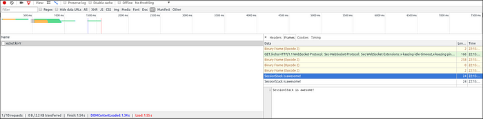
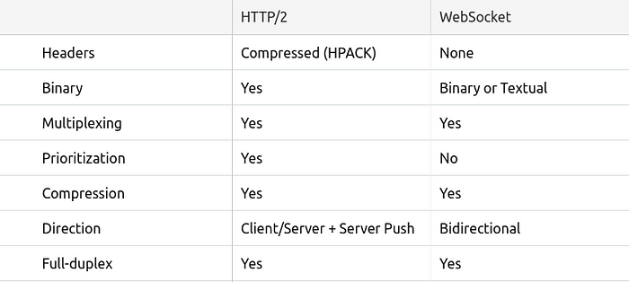
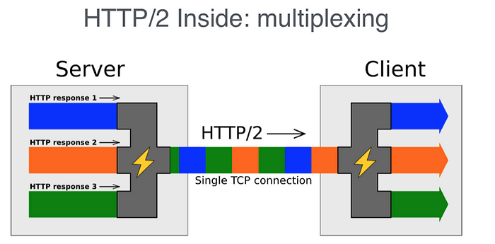

# WebSockets and HTTP/2 with SSE

### Intro

Nowadays complex web apps that feature rich, dynamic UIs are taken for granted. And it's not surprising — the internet has come a long way since its inception.

Initially, the internet wasn't built to support such dynamic and complex web apps. It was conceived to be a collection of HTML pages, linking to one another to form the concept of "web" that contains information. Everything was largely built around the so-called request/response paradigm of HTTP. A client loads up a page and then nothing happens until the user clicks and navigates to the next page.

Around 2005, AJAX was introduced and a lot of people started to explore the possibilities of making connections between a client and а server bidirectional. Still, all HTTP communication was steered by the client, which required user interaction or periodic polling to load new data from the server.

### Making HTTP "bidirectional"

Technologies that enable the server to send data to the client "proactively" have been around for quite some time. "[Push](https://en.wikipedia.org/wiki/Push_technology)" and "[Comet](https://en.wikipedia.org/wiki/Comet_(programming))" to name a few.

One of the most common hacks to create the illusion that the server is sending data to the client is called **long polling**. With long polling, the client opens an HTTP connection to the server which keeps it open until a response is sent. Whenever the server has new data that has to be sent, it transmits it as a response.

Let's see how a very simple long polling snippet might look like:

```javascript
(function poll(){
  setTimeout(function(){
    $.ajax({
      url: 'https://api.example.com/endpoint',
      success: function(data) {
        // Do something with `data`
        // ...

        //Setup the next poll recursively
        poll();
      },
      dataType: 'json'
    });
  }, 10000);
})();
```

This is basically a self-executing function that runs the first time automatically. It sets up the ten (10) second interval and after each async Ajax call to the server, the callback calls `ajax` again.

Other techniques involve [Flash](https://help.adobe.com/en_US/FlashPlatform/reference/actionscript/3/flash/net/Socket.html) or XHR multipart request and the so-called [htmlfiles](http://cometdaily.com/2007/12/27/a-standards-based-approach-to-comet-communication-with-rest/).

All these workarounds share the same problem though: they carry the overhead of HTTP, which doesn't make them well-suited for low-latency applications. Think multiplayer first-person shooter games in the browser or any other online game with a realtime component.

### The introduction of WebSockets

The [WebSocket](https://developer.mozilla.org/en-US/docs/Web/API/WebSockets_API) specification defines an API establishing "socket" connections between a web browser and a server. In plain words: there is a persistent connection between the client and the server and both parties can start sending data at any time.

The client establishes a WebSocket connection through a process known as the WebSocket handshake. This process starts with the client sending a regular HTTP request to the server. An `Upgrade` header is included in this request which informs the server that the client wishes to establish a WebSocket connection.

Let's see how opening a WebSocket connection looks like on the client side:

```javascript
// Create a new WebSocket with an encrypted connection.
var socket = new WebSocket('ws://websocket.example.com');
```

> WebSocket URLs use the `ws` scheme. There is also `wss` for secure WebSocket connections which is the equivalent of `HTTPS`.

This scheme just starts the process of opening a WebSocket connection towards _websocket.example.com_.

Here is a simplified example of the initial request headers.

```plain
GET ws://websocket.example.com/ HTTP/1.1
Origin: http://example.com
Connection: Upgrade
Host: websocket.example.com
Upgrade: websocket
```

If the server supports the WebSocket protocol, it will agree to the upgrade and will communicate this through the `Upgrade` header in the response.

Let's see how this can be implemented in Node.JS:

```javascript
// We'll be using the https://github.com/theturtle32/WebSocket-Node
// WebSocket implementation
var WebSocketServer = require('websocket').server;
var http = require('http');

var server = http.createServer(function(request, response) {
  // process HTTP request. 
});
server.listen(1337, function() { });

// create the server
wsServer = new WebSocketServer({
  httpServer: server
});

// WebSocket server
wsServer.on('request', function(request) {
  var connection = request.accept(null, request.origin);

  // This is the most important callback for us, we'll handle
  // all messages from users here.
  connection.on('message', function(message) {
    // Process WebSocket message
  });

  connection.on('close', function(connection) {
    // Connection closes
  });
});
```

After the connection is established, the server replies by upgrading:

```plain
HTTP/1.1 101 Switching Protocols
Date: Wed, 25 Oct 2017 10:07:34 GMT
Connection: Upgrade
Upgrade: WebSocket
```

Once the connection has been established, the `open` event will be fired on your WebSocket instance on the client side:

```javascript
var socket = new WebSocket('ws://websocket.example.com');

// Show a connected message when the WebSocket is opened.
socket.onopen = function(event) {
  console.log('WebSocket is connected.');
};
```

Now that the handshake is complete the initial HTTP connection is replaced by a WebSocket connection that uses the same underlying TCP/IP connection. At this point, either party can start sending data.

With WebSockets, you can transfer as much data as you like without incurring the overhead associated with traditional HTTP requests. Data is transferred through a WebSocket as messages, each of which consists of one or more _frames_ containing the data you are sending (the payload). In order to ensure the message can be properly reconstructed when it reaches the client each frame is prefixed with 4–12 bytes of data about the payload. Using this frame-based messaging system helps to reduce the amount of non-payload data that is transferred, leading to significant reductions in latency.

**Note:** It's worth noting that the client will only be notified about a new message once all of the frames have been received and the original message payload has been reconstructed.

### WebSocket URLs

We briefly mentioned before that WebSockets introduce a new URL scheme. In reality, they introduce two new schemes: `ws://` and `wss://`.

URLs have scheme-specific grammar. WebSocket URLs are special in that that they do not support anchors ( `#sample_anchor` ).

The same rules apply to WebSocket style URLs as to HTTP style URLs. `ws` is unencrypted and has port 80 as default, while `wss` requires TLS encryption and has port 443 as default.

### Framing protocol

Let's take a deeper look at the framing protocol. This is what the RFC provides us with:

```plain
      0                   1                   2                   3
      0 1 2 3 4 5 6 7 8 9 0 1 2 3 4 5 6 7 8 9 0 1 2 3 4 5 6 7 8 9 0 1
     +-+-+-+-+-------+-+-------------+-------------------------------+
     |F|R|R|R| opcode|M| Payload len |    Extended payload length    |
     |I|S|S|S|  (4)  |A|     (7)     |             (16/64)           |
     |N|V|V|V|       |S|             |   (if payload len==126/127)   |
     | |1|2|3|       |K|             |                               |
     +-+-+-+-+-------+-+-------------+ - - - - - - - - - - - - - - - +
     |     Extended payload length continued, if payload len == 127  |
     + - - - - - - - - - - - - - - - +-------------------------------+
     |                               |Masking-key, if MASK set to 1  |
     +-------------------------------+-------------------------------+
     | Masking-key (continued)       |          Payload Data         |
     +-------------------------------- - - - - - - - - - - - - - - - +
     :                     Payload Data continued ...                :
     + - - - - - - - - - - - - - - - - - - - - - - - - - - - - - - - +
     |                     Payload Data continued ...                |
     +---------------------------------------------------------------+
```

As of the WebSocket version specified by the RFC, there's only a header in front of each packet. It's quite a complex header, however. Here are its building blocks explained:

- `fin` (_1 bit_): indicates if this frame is the final frame that makes up the message. Most of the time the message fits into a single frame and this bit will always be set. Experiments show that Firefox makes a second frame after 32K.
- `rsv1`, `rsv2`, `rsv3` (_1 bit each_): must be 0 unless an extension is negotiated that defines meanings for non-zero values. If a nonzero value is received and none of the negotiated extensions defines the meaning of such a nonzero value, the receiving endpoint must fail the connection.
- `opcode` (_4 bits_): says what the frame represents. The following values are currently in use: `0x00`: this frame continues the payload from the previous. `0x01`: this frame includes text data. `0x02`: this frame includes binary data. `0x08`: this frame terminates the connection. `0x09`: this frame is a ping. `0x0a`: this frame is a pong. (As you can see, there are enough values unused; they've been reserved for future use).
- `mask` (_1 bit_): indicates if the connection is masked. As it stands right now, every message from a client to a server must be masked and the spec would want to terminate the connection if it's unmasked.
- `payload_len` (_7 bits_): the length of the payload. WebSocket frames come in the following length brackets: 0–125 indicates the length of the payload. 126 means that the following two bytes indicate the length, 127 means the next 8 bytes indicate the length. So the length of the payload comes in ~7bit, 16bit, and 64bit brackets.
- `masking-key` (_32 bits_): all frames sent from the client to the server are masked by a 32-bit value that is contained within the frame.
- `payload`: the actual data which most likely is masked. Its length is the length of the `payload_len`.

Why are WebSockets frame-based and not stream-based? I don't know and just like you, I'd love to learn more, so if you have an idea, feel free to add comments and resources in the responses below. Also, a good [discussion on the topic is available on HackerNews](https://news.ycombinator.com/item?id=3377406).

### Data on the frames

As mentioned above, the data can be fragmented into multiple frames. The first frame that transmits the data has an opcode on it that indicates what sort of data is being transmitted. This is necessary because JavaScript has pretty much nonexistent support for binary data at the time the specification was started. `0x01` indicates utf-8 encoded text data, `0x02` is binary data. Most people will transmit JSON in which case you'd probably want to choose the text opcode. When you emit binary data it will be represented in a browser specific [Blob](https://developer.mozilla.org/en-US/docs/Web/API/Blob).

The API for sending data through a WebSocket is very simple:

```javascript
var socket = new WebSocket('ws://websocket.example.com');

socket.onopen = function(event) {
  socket.send('Some message'); // Sends data to server.
};
```

When the WebSocket is receiving data (on the client side), a `message` event is fired. This event includes a property called `data` that can be used to access the contents of the message.

```javascript
// Handle messages sent by the server.
socket.onmessage = function(event) {
  var message = event.data;
  console.log(message);
};
```

You can easily explore the data in each of the frames in your WebSocket connection using the Network Tab inside Chrome DevTools:



### Fragmentation

Payload data can be split up into multiple individual frames. The receiving end is supposed to buffer them up until the `fin` bit is set. So you can transmit the string "Hello World" in 11 packages of 6 (header length) + 1 byte each. Fragmentation is not allowed for control packages. However, the specification wants you to be able to handle [interleaved](https://en.wikipedia.org/wiki/Interleaving_%28data%29) control frames. That's in case TCP packages arrive in arbitrary order.

The logic for joining frames is roughly the following:

- receive the first frame
- remember opcode
- concatenate frame payload together until the `fin` bit is set
- assert that the opcode for each package is zero

The primary purpose of fragmentation is to allow sending a message that is of unknown size when the message is started. With fragmentation, a server may choose a reasonable size buffer and, when the buffer is full, write a fragment to the network. A secondary use case for fragmentation is for multiplexing, where it is not desirable for a large message on one logical channel to take over the whole output channel, so the multiplexing needs to be free to split the message into smaller fragments to better share the output channel.

### What is Hearbeating?

At any point after the handshake, either the client or the server can choose to send a ping to the other party. When the ping is received, the recipient must send back a pong as soon as possible. That's a heartbeat. You can use it to make sure that the client is still connected.

A ping or pong is just a regular frame, but it's a control frame. Pings have an opcode of `0x9`, and pongs have an opcode of `0xA`. When you get a ping, send back a pong with the exact same Payload Data as the ping (for pings and pongs, the max payload length is **125**). You might also get a pong without ever sending a ping. Ignore it if it happens.

Heartbeating can be very useful. There are services (like load balancers) that will terminate idle connections. Plus, it's not possible for the receiving side to see if the remote side has terminated. Only at the next send would you realize that something went wrong.

### Handling Errors

You can handle any errors that occur by listening out for the `error` event.

It looks like this:

```javascript
var socket = new WebSocket('ws://websocket.example.com');

// Handle any error that occurs.
socket.onerror = function(error) {
  console.log('WebSocket Error: ' + error);
};
```

### Closing the Connection

To close a connection either the client or server should send a control frame with data containing an opcode of `0x8`. Upon receiving such a frame, the other peer sends a Close frame in response. The first peer then closes the connection. Any further data received after closing the connection is then discarded.

This is how you initiate the closing of a WebSocket connection from the client:

```javascript
// Close if the connection is open.
if (socket.readyState === WebSocket.OPEN) {
  socket.close();
}
```

Also, in order to perform any clean up after the closing has completed, you can attach an event listener to the `close` event:

```javascript
// Do necessary clean up.
socket.onclose = function(event) {
  console.log('Disconnected from WebSocket.');
};
```

The server has to listen on the `close` event in order to process it if needed:

```javascript
connection.on('close', function(reasonCode, description) {
  // The connection is getting closed.
});
```

### How do WebSockets and HTTP/2 compare?

While HTTP/2 has a lot to offer, it doesn't completely replace the need for existing push/streaming technologies.

The first important thing to notice about HTTP/2 is that it's not a replacement for all of HTTP. The verbs, status codes and most of the headers will remain the same as today. HTTP/2 is about improving the efficiency of the way data is transferred on the wire.

Now, if we compare HTTP/2 to WebSocket, we can see a lot of similarities:



As we have seen above, HTTP/2 introduces [Server Push](https://en.wikipedia.org/wiki/Push_technology?oldformat=true) which enables the server to proactively send resources to the client cache. It does not, however, allow for pushing data down to the client application itself. Server pushes are only processed by the browser and do not pop up in the application code, meaning there is no API for the application to get notifications for those events.

This is where Server-Sent Events (SSE) become very useful. SSE is a mechanism that allows the server to asynchronously push the data to the client once the client-server connection is established. The server can then decide to send data whenever a new "chunk" of data is available. It can be considered as a one-way [publish-subscribe](https://en.wikipedia.org/wiki/Publish%E2%80%93subscribe_pattern) model. It also offers a standard JavaScript client API named EventSource implemented in most modern browsers as part of the HTML5 standard by [W3C](https://html.spec.whatwg.org/multipage/). Note that browsers that do not support [EventSource API](https://caniuse.com/eventsource) can be easily polyfilled.

Since SSE is based on HTTP, it has a natural fit with HTTP/2 and can be combined to get the best of both: HTTP/2 handling an efficient transport layer based on multiplexed streams and SSE providing the API up to the applications to enable push.

To fully understand what Streams and Multiplexing are all about, let's first have a look at the IETF definition: _a "stream" is an independent, bidirectional sequence of frames exchanged between the client and server within an HTTP/2 connection. One of its main characteristics is that a single HTTP/2 connection can contain multiple concurrently open streams, with either endpoint interleaving frames from multiple streams_.



We have to remember that SSE is HTTP-based. It means that with HTTP/2, not only can several SSE streams be interleaved onto a single TCP connection, but the same can also be done with a combination of several SSE streams (server to client push) and several client requests (client to server). Thanks to HTTP/2 and SSE, now we have a pure HTTP bidirectional connection with a simple API to let application code register to server pushes. Lack of bidirectional capabilities has often been perceived as a major drawback when comparing SSE to WebSocket. Thanks to HTTP/2 this is no longer the case. This opens up the opportunity to skip WebSockets and stick to an HTTP-based signaling instead.

### How to choose between WebSocket and HTTP/2?

WebSockets will certainly survive the domination of HTTP/2 + SSE, mainly because it's a technology already well adopted and, in very specific use cases, it has an advantage over HTTP/2 as it has been built for bidirectional capabilities with less overhead (e.g. headers).

Say you want to build a Massive Multiplayer Online Game that needs a huge amount of messages from both ends of the connection. In such a case, WebSockets will perform much, much better.

In general, use WebSockets whenever you need a truly low-latency, near realtime connection between the client and the server. Keep in mind that this might require rethinking how you build your server-side applications, as well as shifting the focus on technologies like event queues.

If your use case requires displaying real-time market news, market data, chat applications, etc., relying on HTTP/2 + SSE will provide you with an efficient bidirectional communication channel while reaping the benefits from staying in the HTTP world:

- WebSockets can often be a source of pain when considering compatibility with existing web infrastructure as it upgrades an HTTP connection to a completely different protocol that has nothing to do with HTTP.
- Scale and security: Web components (Firewalls, Intrusion Detection, Load Balancers) are built, maintained and configured with HTTP in mind, an environment that large/critical applications will prefer in terms of resiliency, security, and scalability.
