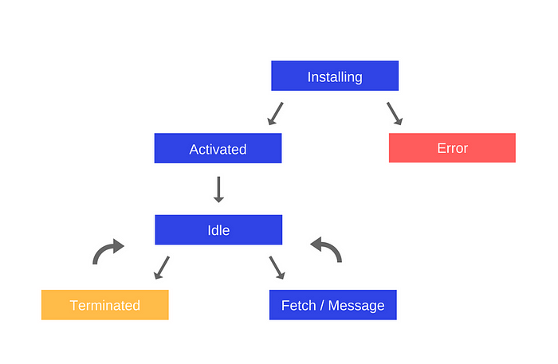

# Service Workers, their Lifecycle and Use Cases

### Overview

Basically, the Service Worker is a type of Web Worker, and more specifically it's like a [Shared Worker](https://developer.mozilla.org/en-US/docs/Web/API/SharedWorker):

- The Service Worker runs in its own global script context
- It isn't tied to a specific web page
- It cannot access the DOM

One of the main reasons why the Service Worker API is so exciting is that it allows your web apps to support offline experiences, giving developers complete control over the flow.

### Lifecycle of a Service Worker

The lifecycle of a service worker is completely separated from your web page one. It consists of the following phases:

- Download
- Installation
- Activation

### Download

This is when the browser downloads the `.js` file which contains the Service Worker.

### Installation

To install a Service Worker for your web app, you have to register it first, which you can do in your JavaScript code. When a Service Worker is registered, it prompts the browser to start a Service Worker install step in the background.

By registering the Service Worker, you tell the browser where your Service Worker JavaScript file lives. Let's look at the following code:

```javascript
if ('serviceWorker' in navigator) {
  window.addEventListener('load', function() {
    navigator.serviceWorker.register('/sw.js').then(function(registration) {
      // Registration was successful
      console.log('ServiceWorker registration successful');
    }, function(err) {
      // Registration failed
      console.log('ServiceWorker registration failed: ', err);
    });
  });
}
```

The code checks whether the Service Worker API is supported in the current environment. If it is, the `/sw.js` Service Worker is registered.

You can call the `register()` method every time a page loads with no concern — the browser will figure out if the service worker has already been registered, and will handle it properly.

An important detail of the `register()` method is the location of the service worker file. In this case you can see that the service worker file is at the root of the domain. This means that the service worker's scope will be the entire origin. In other words, this service worker will receive `fetch` events (which we'll discuss later) for everything on this domain. If we register the service worker file at `/example/sw.js`, then the service worker would only see `fetch` events for pages which URLs start with `/example/` (i.e. `/example/page1/`, `/example/page2/`).

During the installation phase, it's best to load and cache some static assets. Once the assets are successfully cached, the Service Worker installation is complete. If not (the loading fails) — the Service Worker will do a retry. Once installed successfully, you'll know that the static assets are in the cache.

This answers your question if registration need to happen after the load event. It's not a must, but it's definitely recommended.

Why so? Let's consider a user's first visit to your web app. There's no service worker yet, and the browser has no way of knowing in advance whether there will be a service worker that will eventually be installed. If the Service Worker gets installed, the browser will need to spend extra CPU and memory for this additional thread which otherwise the browser will spend on rendering the web page instead.

The bottom line is that , if you just install a Service Worker on your page, you're running the risk of delaying the loading and rendering — not making the page available to your users as quickly as possible.

Note that this is important only for the first page visit. Subsequent page visits don't get impacted by the Service Worker installation. Once a Service Worker is activated on a first page visit, it can handle loading/caching events for subsequent visits to your web app. This all makes sense, because it needs to be ready to handle limited network connectivity.

### Activation

After the Service Worker is installed, the next step will be its activation. This step is a great opportunity to manage previous caches.

Once activated, the Service Worker will start controlling all pages that fall under its scope. An interesting fact: the page that registered the Service Worker for the first time won't be controlled until that page is loaded again. Once the Service Worker is in control, it will be in one of the following states:

- It will handle fetch and message events that occur when a network request or message is made from the page.
- It will be terminated to save memory.

Here is how the lifecycle will look like:



### Handling the installation inside the Service Worker

After a page spins up the registration process, let's see what happens inside the Service Worker script, which handles the `install` event by adding an event listener to the Service Worker instance.

Those are the steps that need to be taken when the `install` event is handled:

- Open a cache.
- Cache our files.
- Confirm whether all of the required assets are cached.

Here is what a simple installation might look like inside a Service Worker:

```javascript
var CACHE_NAME = 'my-web-app-cache';
var urlsToCache = [
  '/',
  '/styles/main.css',
  '/scripts/app.js',
  '/scripts/lib.js'
];

self.addEventListener('install', function(event) {
  // event.waitUntil takes a promise to know how
  // long the installation takes, and whether it 
  // succeeded or not.
  event.waitUntil(
    caches.open(CACHE_NAME)
      .then(function(cache) {
        console.log('Opened cache');
        return cache.addAll(urlsToCache);
      })
  );
});
```

If all the files are successfully cached, then the service worker will be installed. If any of the files fail to download, then the install step will fail. So be careful what files you put there.

Handling the `install` event is completely optional, and you can avoid it, in which case you don't need to perform any of the steps here.

### Caching requests during runtime

This part is the real-deal. This is where you'll see how to intercept requests and return the created caches (and create new ones).

After a Service Worker is installed and the user navigates to another page or refreshes the page he's on, the Service Worker will receive fetch events. Here is an example that demonstrates how to return cached assets or perform a new request and then cache the result:

```javascript
self.addEventListener('fetch', function(event) {
  event.respondWith(
    // This method looks at the request and
    // finds any cached results from any of the
    // caches that the Service Worker has created.
    caches.match(event.request)
      .then(function(response) {
        // If a cache is hit, we can return thre response.
        if (response) {
          return response;
        }

        // Clone the request. A request is a stream and
        // can only be consumed once. Since we are consuming this
        // once by cache and once by the browser for fetch, we need
        // to clone the request.
        var fetchRequest = event.request.clone();

        // A cache hasn't been hit so we need to perform a fetch,
        // which makes a network request and returns the data if
        // anything can be retrieved from the network.
        return fetch(fetchRequest).then(
          function(response) {
            // Check if we received a valid response
            if(!response || response.status !== 200 || response.type !== 'basic') {
              return response;
            }

            // Cloning the response since it's a stream as well.
            // Because we want the browser to consume the response
            // as well as the cache consuming the response, we need
            // to clone it so we have two streams.
            var responseToCache = response.clone();

            caches.open(CACHE_NAME)
              .then(function(cache) {
                // Add the request to the cache for future queries.
                cache.put(event.request, responseToCache);
              });

            return response;
          }
        );
      })
  );
});
```

Here is what happens in a nutshell:

- The `event.respondWith()` will determine how we'll respond to the `fetch` event. We pass a promise from `caches.match()` which looks at the request and finds if there are any cached results from any of the caches that have been created.
- If there is a cache, the response is retrieved.
- Otherwise, a `fetch` will be performed.
- Check if the status is `200`. We also check that the response type is basic, which indicates that it's a request from our origin. Requests to third party assets won't be cached in this case.
- The response is added to the cache.

Requests and responses have to be cloned because they're [streams](https://streams.spec.whatwg.org/). The body of a stream can be consumed only once. And since we want to consume them, we want to clone them because the browser has to consume them as well.

### Updating a Service Worker

When a user visits your web app, the browser tries to re-download the `.js` file that contains your Service Worker code. This takes place in the background.

If there is even a single byte difference in the Service Worker's file that was downloaded now compared to the current Service Worker's file, the browser will assume that there is a change and a new Service Worker has to be started.

The new Service Worker will be started and the install event will be fired. At this point, however, the old Service Worker is still controlling the pages of your web app which means that the new Service Worker will enter a `waiting` state.

Once the currently opened pages of your web app are closed, the old Service Worker will be killed by the browser and the newly-installed Service Worker will take full control. This is when its activate event will be fired.

Why is all this needed? To avoid the problem of having two versions of a web app running simultaneously , in different tabs — something that is actually very common on the web and can create really bad bugs (e.g. cases in which you have different schema while storing data locally in the browser).

### Deleting data from the cache

The most common step in the `activate` callback is cache management. You'd want to do this now because if you were to wipe out any old caches in the install step, old Service Workers will suddenly stop being able to serve files from that cache.

Here is an example how you can delete some files from the cache that are not whitelisted (in this case, having `page-1` or `page-2` under their names):

```javascript
self.addEventListener('activate', function(event) {
  var cacheWhitelist = ['page-1', 'page-2'];

  event.waitUntil(
    // Retrieving all the keys from the cache.
    caches.keys().then(function(cacheNames) {
      return Promise.all(
        // Looping through all the cached files.
        cacheNames.map(function(cacheName) {
          // If the file in the cache is not in the whitelist
          // it should be deleted.
          if (cacheWhitelist.indexOf(cacheName) === -1) {
            return caches.delete(cacheName);
          }
        })
      );
    })
  );
});
```

### HTTPS requirement

When you're building your web app, you'll be able to use Service Workers through localhost, but once you deploy it in production, you need to have HTTPS ready (and that's the last reason for you to have HTTPS).

Using a Service Worker, you can hijack connections and fabricate responses. By not using HTTPs, your web app becomes prone to a [man-in-the-middle attacks](https://en.wikipedia.org/wiki/Man-in-the-middle_attack).

To make things safer, you're required to register Service Workers on pages that are served over HTTPS so that you know that the Service Worker which the browser receives, hasn't been modified while traveling through the network.

### Service Workers are opening the doors for great features

Some unique features that a Service Worker provides are:

- **Push notifications** — allow users to opt-in to timely updates from web apps.
- **Background sync** — allows you to defer actions until the user has stable connectivity. This way, you can make sure that whatever the user wants to send, is actually sent.
- **Periodic sync** (future) — API that provides functionality for managing periodic background synchronization.
- **Geofencing** (future) — you can define parameters, also referred to as geofences which surround the areas of interest. The web app gets a notification when the device crosses a geofence, which allows you to provide useful experience based on the geography of the user.
