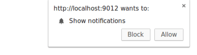
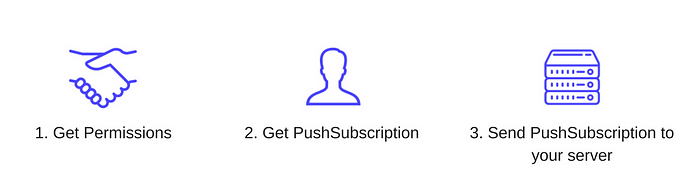
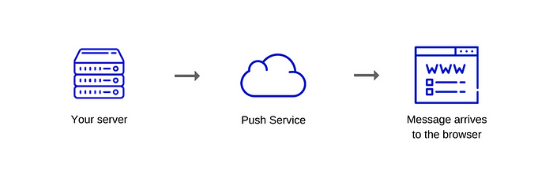

# The Mechanics of Web Push Notifications

### Overview

Web Push Notifications allow users to opt-in for timely updates from web apps that aim to re-engage their user base with content that might be interesting, important and well-timed for the users.

The reason for employing Service Workers, in this case, is because they operate in the background. This is great for Push Notifications because it means that their code is being executed only when a user interacts with the notification itself.

### Push & notification

Push and notification are two different APIs.

- [Push](https://developer.mozilla.org/en-US/docs/Web/API/Push_API) — it is invoked when the server supplies information to a Service Worker.
- [Notification](https://developer.mozilla.org/en-US/docs/Web/API/Notifications_API) — this is the action of a Service Worker or a script in a web app that shows information to the user.

### Push

There are three general steps to implementing a push:

1. **The UI** — adding the necessary client-side logic to subscribe a user to a push. This is the JavaScript logic that your web app UI needs in order to enable the user to register himself to push messages.
2. **Sending the push message** — implementing the API call on your server that triggers a push message to the user's device.
3. **Receiving the push message** — handling the push message once it arrives in the browser.

Now we'll describe the whole process in more detail.

### Browser support detection

First, we need to check if the current browser supports push messaging. We can check if push is supported by two simple checks:

1. Check for `serviceWorker` on the `navigator` object
2. Check for `PushManager` on the `window` object

Both checks look like this:

```javascript
if (!('serviceWorker' in navigator)) { 
  // Service Worker isn't supported on this browser, disable or hide UI. 
  return; 
}

if (!('PushManager' in window)) { 
  // Push isn't supported on this browser, disable or hide UI. 
  return; 
}
```

### Register a Service Worker

At this point, we know that the feature is supported. The next step is to register our Service Worker.

### Requesting permission

After a Service Worker has been registered, we can proceed with subscribing the user. To do so, we need to get his permission to send him push messages.

The API for getting permission is relatively simple, the downside, however, is that the API has [changed from taking a callback to returning a Promise](https://developer.mozilla.org/en-US/docs/Web/API/Notification/requestPermission_static). This introduces a problem: we can't tell what version of the API has been implemented by the current browser, so you have to implement and handle both.

It looks something like this:

```javascript
function requestPermission() {
  return new Promise(function(resolve, reject) {
    const permissionResult = Notification.requestPermission(function(result) {
      // Handling deprecated version with callback.
      resolve(result);
    });

    if (permissionResult) {
      permissionResult.then(resolve, reject);
    }
  })
  .then(function(permissionResult) {
    if (permissionResult !== 'granted') {
      throw new Error('Permission not granted.');
    }
  });
}
```

The `Notification.requestPermission()` call will display the following prompt to the user:



Once the permission has been granted, closed, or blocked, we'll be given the result as a string: `granted`, `default` or `denied`.

Keep in mind that if the user clicks on the `Block` button, your web app will not be able to ask the user for permission again until they manually "unblock" your app by changing the permission state. This option is buried in the settings panel.

### Subscribing a user with PushManager

Once we have our Service Worker registered, and we've got permission, we can subscribe a user by calling `registration.pushManager.subscribe()` when you register your Service Worker.

The whole snippet might look like this (including the Service Worker registration):

```javascript
function subscribeUserToPush() {
  return navigator.serviceWorker.register('service-worker.js')
  .then(function(registration) {
    var subscribeOptions = {
      userVisibleOnly: true,
      applicationServerKey: btoa(
        'BEl62iUYgUivxIkv69yViEuiBIa-Ib9-SkvMeAtA3LFgDzkrxZJjSgSnfckjBJuBkr3qBUYIHBQFLXYp5Nksh8U'
      )
    };

    return registration.pushManager.subscribe(subscribeOptions);
  })
  .then(function(pushSubscription) {
    console.log('PushSubscription: ', JSON.stringify(pushSubscription));
    return pushSubscription;
  });
}
```

The `registration.pushManager.subscribe(options)` takes an _options_ object, which consists of both required and optional parameters:

- **userVisibleOnly:** A boolean indicating that the returned push subscription will only be used for messages which effect is made visible to the user. It has to be set to `true` otherwise you'll get an error (there are historical reasons for this).
- **applicationServerKey:** A Base64-encoded `DOMString` or `ArrayBuffer` containing a public key that the push server will use to authenticate your application server.

Your server needs to generate a pair of application server keys — these are also known as VAPID keys, which are unique to your server. They are a pair of a public and a private key. The private key is secretly stored on your end, while the public one gets exchanged with the client. The keys allow a push service to know which application server subscribed a user and ensure that it's the same server that triggers the push messages to that particular user.

You need to create the private/public key pair only once for your application. One way of doing it is going to https://web-push-codelab.glitch.me/ .

The browser passes the `applicationServerKey` (the public one) onto a push service when subscribing the user, meaning that the push service can tie your application's public key to the user's `PushSubscription`.

This is what happens:

- Your web app is loaded, and you call `subscribe()` , passing your server key.
- The browser makes a network request to a push service that will generate an endpoint, associate this endpoint with the key and return the endpoint to the browser.
- The browser will add this endpoint to the `PushSubscription` object, which is returned via the `subscribe()` promise.

Later, whenever you want to send a push message, you'll need to create an **Authorization header** which contains information signed with your application server's private key. When the push service receives a request to send a push message, it will validate the header by looking up the public key that it has already linked to that particular endpoint (the second step).

### The PushSubscription object

A `PushSubscription` contains all the information that is needed to send a push message to the user's device. This is how it looks like:

```plain
{
  "endpoint": "https://domain.pushservice.com/some-id",
  "keys": {
    "p256dh": "BIPUL12DLfytvTajnryr3PJdAgXS3HGMlLqndGcJGabyhHheJYlNGCeXl1dn18gSJ1WArAPIxr4gK0_dQds4yiI=",
    "auth": "FPssMOQPmLmXWmdSTdbKVw=="
  }
}
```

The `endpoint` is the push services URL. To trigger a push message, make a POST request to this URL.

The `keys` object contains the values used to encrypt message data sent with a push message.

Once a user is subscribed, and you have a `PushSubscription` you need to send it to your server. There (on the server) you'll save the subscription to a database and from now on use it to send push messages to that user.



### Sending the push message

When you want to send a push message to your users, the first thing you need is a push service. You're telling the push service (via API call) what data to send, who to send the message to and any criteria about how to send the message. Normally, this API call is done from your server.

### Push Services

A push service is one that receives requests, validates them and delivers the push message to the proper browser.

Note that the push service is not managed by you — it's a third-party service. Your server is the one that communicates with the push service through an API. An example of a push service is [Google's FCM](https://firebase.google.com/docs/cloud-messaging/).

The push service handles all the heavy lifting. For example, if the browser is offline, the push service will queue up messages and wait until the browser goes online again, before sending the respective message.

Each browser can use any push service they want and this is something that's beyond the control of the developer.

All push services, however, have the same APIs so this doesn't create implementation difficulties.

In order to get the URL which will handle the requests for your push messages, you need to check the stored value of `endpoint` in the `PushSubscription` object.

### Push Service API

The Push Service API provides a way to send messages to a user. The API is the [Web Push Protocol](https://datatracker.ietf.org/doc/html/draft-ietf-webpush-protocol-12) which is an IETF standard that defines how you make an API call to a push service.

The data you send with a push message must be encrypted. This way, you prevent push services from being able to view the data sent. This is important because the browser is the one that decides which push service to use (and it might be using some push service that is untrusted and not secure enough).

For each push message, you can also give the following instructions:

- **TTL** — defines for how long a message should be queued before it's removed and not delivered.
- **Priority** — defines the priority of each message which will let the push service send only the high priority ones in case the user device's battery life has to be preserved.
- **Topic** — gives a push message a topic name which will replace pending messages with the same topic so that once the device is active, the user won't receive outdated information.



### Push event in the browser

Once you send the message to the push service as explained above, the message will be in a pending state until one of the following happens:

- The device comes online.
- The message expires on the queue due to the TTL.

When the push service delivers a message, the browser will receive it, decrypt it and dispatch a `push` event in your Service Worker.

The great thing here is that the browser can execute your Service Worker even when your web page is not open. The following takes place:

- The push message arrives to the browser which decrypts it
- The browser wakes up the Service Worker
- A `push` event is dispatched to the Service Worker

The code for setting up a push event listener should be pretty similar to any other event listener you'd write in JavaScript:

```javascript
self.addEventListener('push', function(event) {
  if (event.data) {
    console.log('This push event has data: ', event.data.text());
  } else {
    console.log('This push event has no data.');
  }
});
```

One of the things to understand about Service Workers is that you have little control over the time the service worker code is going to run. The browser decides when to wake it up and when to terminate it.

In Service Workers, `event.waitUntil(promise)` tells the browser that work is ongoing until the promise settles, and it shouldn't terminate the service worker if it wants that work to complete.

Here is an example of handling the `push` event:

```javascript
self.addEventListener('push', function(event) {
  var promise = self.registration.showNotification('Push notification!');

  event.waitUntil(promise);
});
```

Calling `self.registration.showNotification()` displays a notification to the user and it returns a promise that will resolve once the notification has been displayed.

The `showNotification(title, options)` method can be visually tweaked to fit your needs. The `title` parameter is a `string` while options is an object that looks like this:

```plain
{
  "//": "Visual Options",
  "body": "<String>",
  "icon": "<URL String>",
  "image": "<URL String>",
  "badge": "<URL String>",
  "vibrate": "<Array of Integers>",
  "sound": "<URL String>",
  "dir": "<String of 'auto' | 'ltr' | 'rtl'>",

  "//": "Behavioural Options",
  "tag": "<String>",
  "data": "<Anything>",
  "requireInteraction": "<boolean>",
  "renotify": "<Boolean>",
  "silent": "<Boolean>",

  "//": "Both Visual & Behavioural Options",
  "actions": "<Array of Strings>",

  "//": "Information Option. No visual affect.",
  "timestamp": "<Long>"
}
```

You can read in more detail what each option does here — https://developer.mozilla.org/en-US/docs/Web/API/ServiceWorkerRegistration/showNotification.

Push notifications can be a great way of getting your users' attention whenever there is urgent, important and time-sensitive information that you'd like to share with them.
